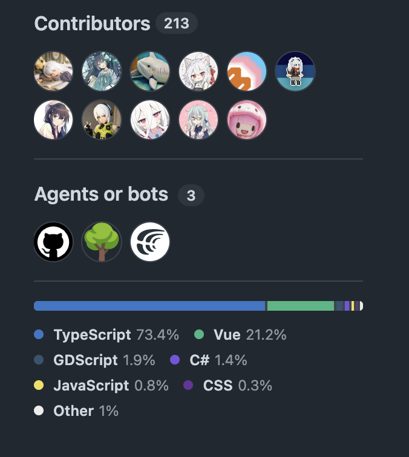

# GitHub Agents or bots

A userscript that separates automated contributors from people on GitHub
repository homepages and contributor graphs.

## Install

1. Install a userscript manager such as Tampermonkey.
2. Open the [userscript](https://raw.githubusercontent.com/luoling8192/github-agents-or-bots/main/github-agents-or-bots.user.js).
3. Confirm the installation, then reload GitHub.

## What it does

- Moves bot avatars from a repository homepage's Contributors panel into an
  **Agents or bots** panel using GitHub's native layout.
- Adds **Contributors** and **Agents or bots** views to
  `/OWNER/REPO/graphs/contributors`, including `?all=1`.
- Uses GitHub's own contributor data endpoint to avoid fighting its virtualized
  list and causing layout flicker.
- Preserves the relative order and original rank of contributors.

On repository homepages, the script only groups accounts already shown in
GitHub's Contributors preview. GitHub does not load the complete contributor
list there, so agents or bots outside that preview will not appear in the
separate panel. Use the contributor graph to view the complete grouping.

No token, cross-site request, remote dependency, or privileged userscript grant
is required.

## Matching rules

The script recognizes:

- logins ending in `bot`, `-bot`, or `[bot]`;
- GitHub App profile links, bot hovercards, and GitHub App avatars;
- exact logins in `agentLogins` and `additionalBotLogins`.

The maintained Agent list currently includes `copilot`, `codex`, `openai-codex`,
`claude`, and `cursoragent`. Add false positives to `humanLogins`; this override
takes precedence over every automatic rule.

Matching is deliberately conservative. Automation using a normal person's
account cannot be inferred reliably.

## Development

Serve the repository root and open `/test/repo/`, then select **Run regression
tests**. The fixture covers homepage splitting, contributor graph views, delayed
rendering, navigation, Turbo cache restoration, and stable Agent cards.

The userscript was validated against the current GitHub repository homepage and
Contributors page structures. GitHub can change that markup without notice.

## License

MIT
